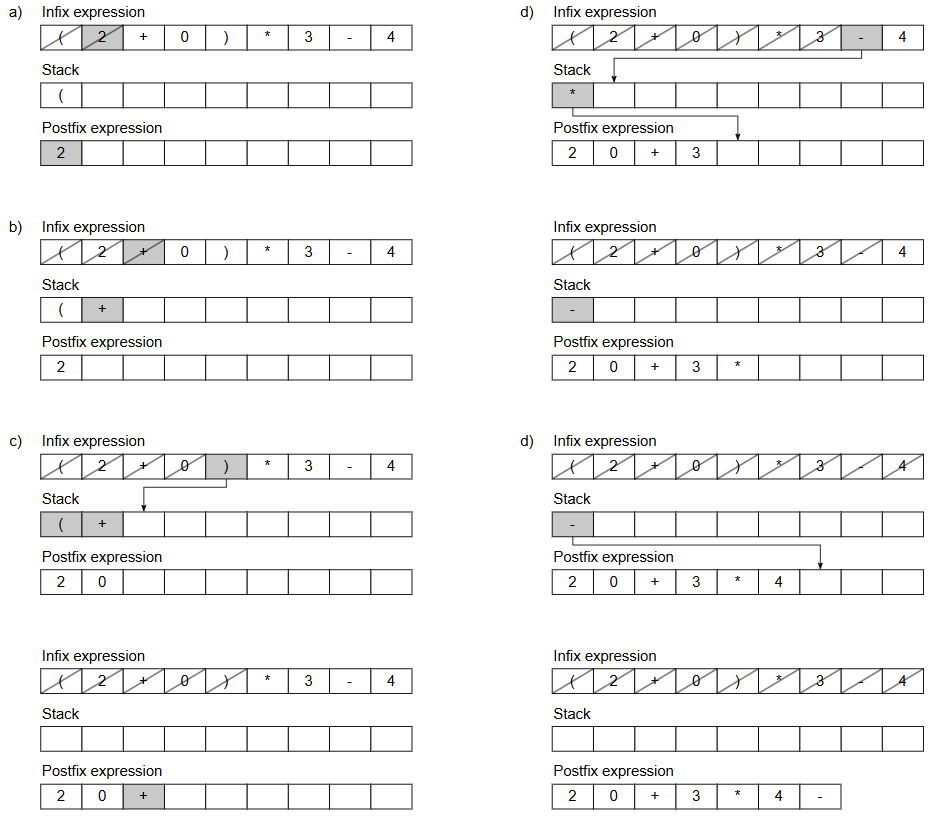
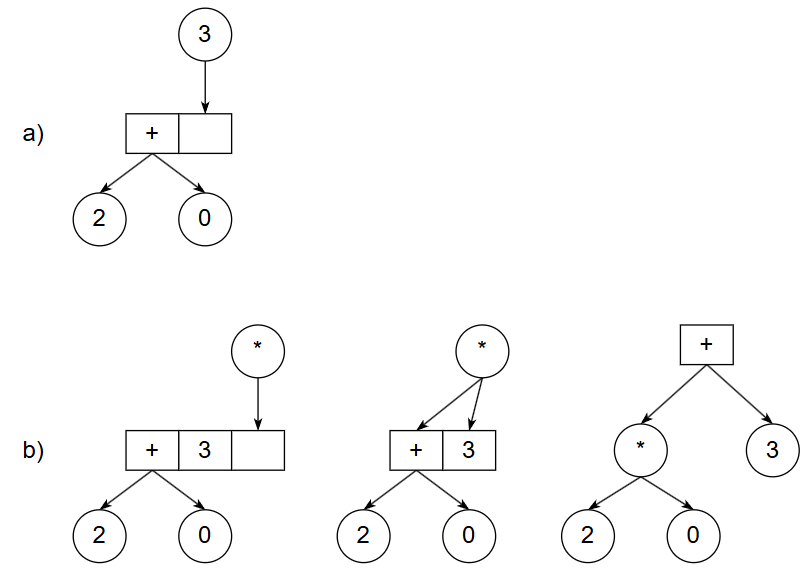
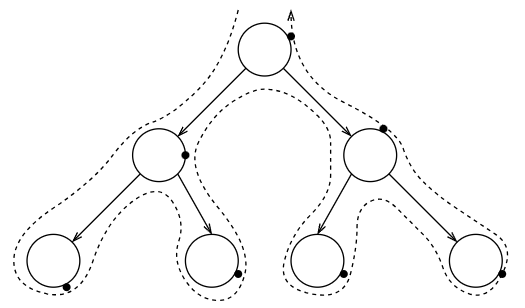

# Binary Expression Tree Implementation

2021

This repository contains an implementation of the Binary Expression Tree data structure. It is used to represent mathematical expressions and allows efficient evaluation of them by breaking down into binary operations (addition, subtraction, division, multiplication, exponentiation). Each leaf node represents an operand (like a number), and each internal node represents an operator. Binary Expression Trees are commonly used in compilers, calculators, and expression parsers to evaluate and optimise mathematical operations.

## General Algorithm of the Program

The algorithm for processing the expression can be divided into the following steps:

1. Input the expression string (postfix, infix, prefix)

2. Process the string, identify the operators and operands, and convert the infix expression into postfix form

3. Build the tree based on the identified operators and operands

4. Traverse the tree and evaluate the expression

5. Display the result, either the calculated value or an error message if the expression is invalid

## Converting Infix Notation to Prefix Notation

The main principle of the solution method is to build a tree based on postfix and prefix expressions. Infix notation is converted to postfix using the shunting yard algorithm developed by Edsger Dijkstra.

Building the tree directly from infix notation is more complex because, during the calculation of an infix arithmetic expression, we must traverse the expression in both directions.

The shunting yard algorithm works as follows:

- If the expression element is a number, it is placed in the resulting postfix expression (Fig. 1a).

- If the stack is empty or the element is an open parenthesis or an operator with higher priority than the one in the stack, the operator is added to the stack (Fig. 1b).

- If the symbol is a closing parenthesis, all elements in the stack are moved to the result until an open parenthesis is found, which is then removed (Fig. 1c). If the operator priority is lower or equal to the operator in the stack, elements are moved to the result while this condition holds. Finally, the operator is placed in the stack (Fig. 1d).

- If the stack is not empty after the cycle, everything left is moved to the result (Fig. 1e).

Fig. 1

## Tree Construction Algorithm

The tree is built using the following algorithm:

- If the method receives a number, a leaf node containing that number is added to the end of the array (Fig. 2a).

- If the method receives an operator, a node is created containing the operator as data. For a postfix expression, the second and first elements from the end of the array are linked as the left and right children, respectively. For a prefix expression, the first and second elements from the end are linked as the left and right children, respectively. In other words, the node linking changes based on the expression type, but the resulting subtree is the same in both cases. Finally, the formed subtree is added to the end of the array. The algorithm is shown in Fig. 2b.

It’s important to note that the tree will be the same, regardless of the notation form of the expression.

Fig. 2

## Tree Traversal Algorithm

Since the tree structure will remain the same regardless of the expression's format, the method for traversing and evaluating the expression tree will be consistent. It is based on a post-order traversal, as we need to first obtain the two values (left and right nodes) and then perform the operation on them (parent node). The traversal works as follows: first, the left and right subtrees are recursively traversed, and then the root node is processed. The algorithm is schematically shown in Fig. 3.

Fig. 3

